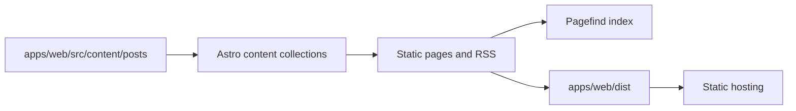

# danhthanh.dev

Astro 7 static blog with an editorial developer-portfolio interface. The site is built from Markdown/MDX content in `apps/web/src/content/posts`, validated by Astro content collections, and emitted as static HTML.

## Quick start

```bash
pnpm install
cp .env.example apps/web/.env
pnpm dev
```

Open `http://localhost:4321`.

## Stack

| Area      | Technology                               |
| --------- | ---------------------------------------- |
| Framework | Astro 7 static output                    |
| Styling   | Tailwind CSS v4 + shadcn/ui tokens       |
| Content   | Astro content collections + Markdown/MDX |
| Search    | Pagefind + Fuse.js                       |
| Tests     | Vitest + Playwright                      |
| Quality   | ESLint + Prettier + Lefthook             |

## Architecture



## Routes

- `/:lang/` — home
- `/:lang/blog` — searchable archive
- `/:lang/blog/:slug` — article
- `/:lang/about` — author page
- `/rss.xml` — RSS feed

## Commands

| Command             | Purpose                         |
| ------------------- | ------------------------------- |
| `pnpm dev`          | Start the web app               |
| `pnpm build`        | Build the static site           |
| `pnpm preview`      | Preview the production build    |
| `pnpm test`         | Run unit tests                  |
| `pnpm test:e2e`     | Run Playwright tests            |
| `pnpm lint`         | Run ESLint                      |
| `pnpm format:check` | Check formatting                |
| `pnpm typecheck`    | Run Astro and TypeScript checks |
| `pnpm check`        | Run the full quality gate       |

## Content workflow

Add or edit localized Markdown/MDX files under `apps/web/src/content/posts/{vi,en}`. Each post must satisfy the schema in `apps/web/src/content.config.ts`. A production build generates the OG image, static pages, and Pagefind search index.

## Deployment

```bash
pnpm install
pnpm build
```

Deploy `apps/web/dist` to any static host. Set `SITE_URL` for canonical URLs, RSS, sitemap, and social metadata.

## License

MIT — see [LICENSE](LICENSE).
