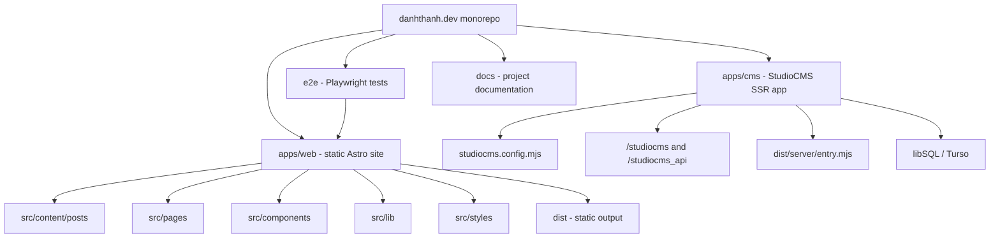
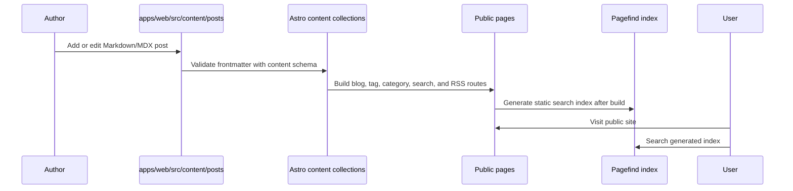
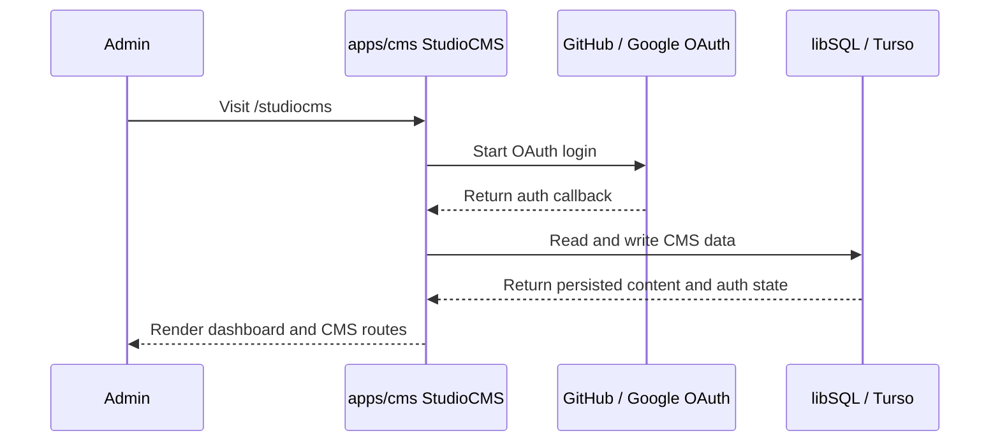
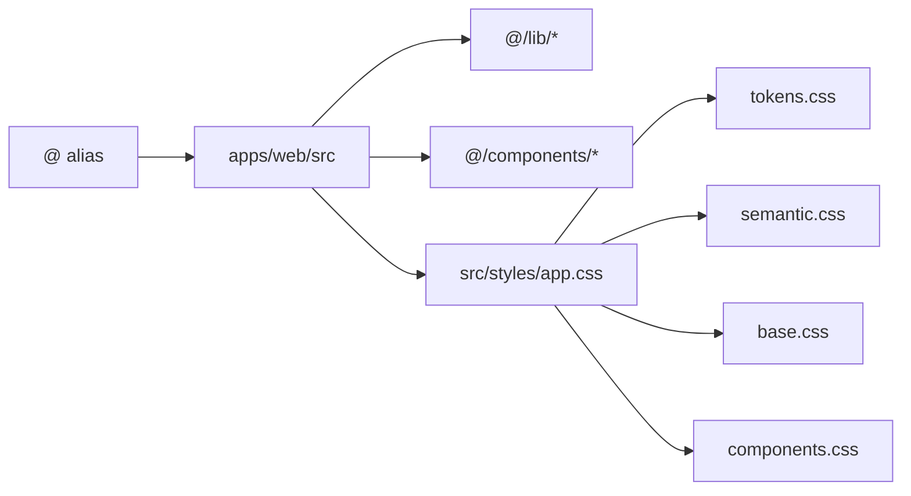

# Project Architecture Diagrams

These diagrams summarize the current monorepo structure. For the prose overview, see [Architecture Overview](./reference/architecture.md).

## Workspace Map

## Web Content Flow

## CMS Runtime Flow

## Import And Styling Patterns

