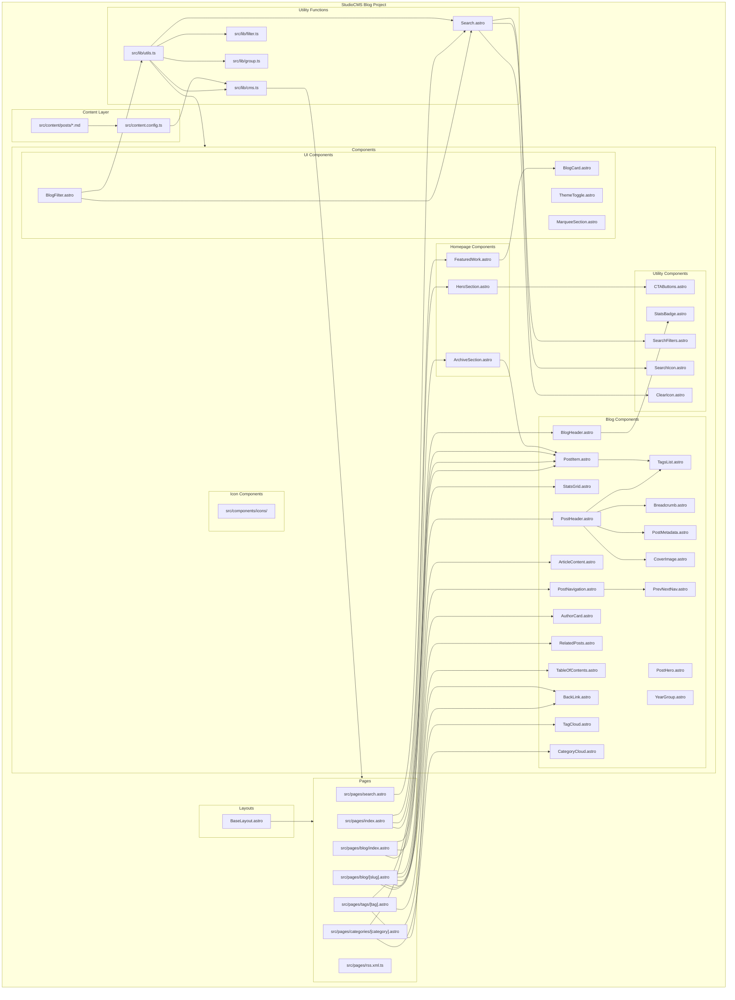
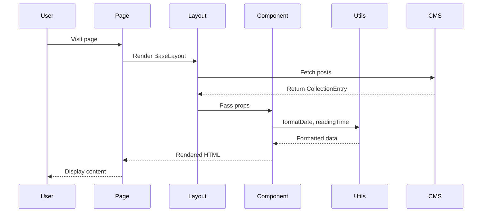
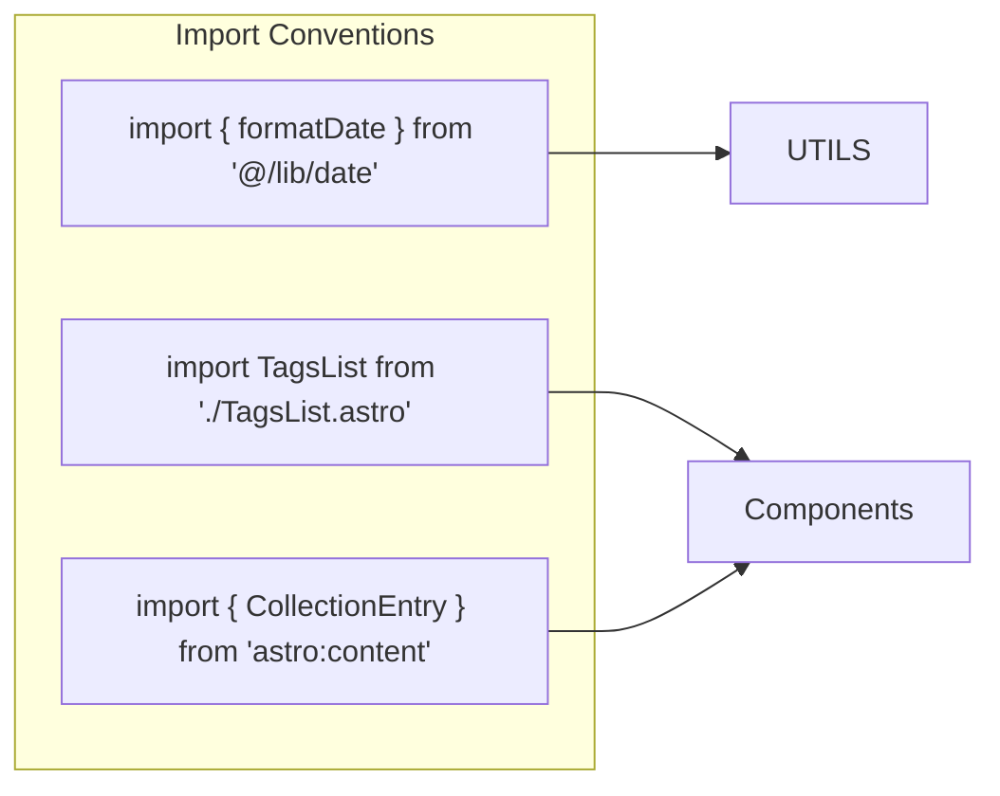
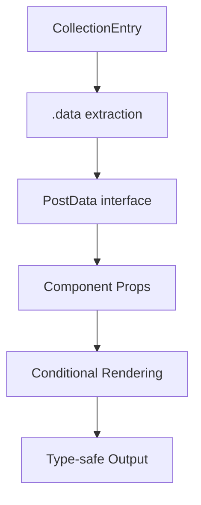

# StudioCMS Blog - Project Architecture

```mermaid
graph TB
    subgraph Project["StudioCMS Blog Project"]
        subgraph Content["Content Layer"]
            CONTENT["src/content/posts/*.md"]
            CONTENT_CONFIG["src/content.config.ts"]
        end

        subgraph Utils["Utility Functions"]
            UTILS["src/lib/utils.ts"]
            CMS["src/lib/cms.ts"]
            SEARCH["src/lib/search.ts"]
            FILTER["src/lib/filter.ts"]
            GROUP["src/lib/group.ts"]
        end

        subgraph Components["Components"]
            subgraph BlogComponents["Blog Components"]
                BLOG_HEADER["BlogHeader.astro"]
                STATS_GRID["StatsGrid.astro"]
                POST_HERO["PostHero.astro"]
                ARTICLE_CONTENT["ArticleContent.astro"]
                POST_NAV["PostNavigation.astro"]
                TAGS_LIST["TagsList.astro"]
                AUTHOR_CARD["AuthorCard.astro"]
                RELATED_POSTS["RelatedPosts.astro"]
                BACK_LINK["BackLink.astro"]
                TAG_CLOUD["TagCloud.astro"]
                CAT_CLOUD["CategoryCloud.astro"]
                BREADCRUMB["Breadcrumb.astro"]
                POST_META["PostMetadata.astro"]
                COVER_IMG["CoverImage.astro"]
                POST_ITEM["PostItem.astro"]
                POST_HEADER["PostHeader.astro"]
                TOC["TableOfContents.astro"]
                PREV_NEXT["PrevNextNav.astro"]
                YEAR_GROUP["YearGroup.astro"]
            end

            subgraph HomeComponents["Homepage Components"]
                HERO["HeroSection.astro"]
                FEATURED["FeaturedWork.astro"]
                ARCHIVE["ArchiveSection.astro"]
            end

            subgraph UtilityComponents["Utility Components"]
                STATS_BADGE["StatsBadge.astro"]
                CTA["CTAButtons.astro"]
                SEARCH_FILTERS["SearchFilters.astro"]
                SEARCH_ICON["SearchIcon.astro"]
                CLEAR_ICON["ClearIcon.astro"]
            end

            subgraph UIComponents["UI Components"]
                BLOG_CARD["BlogCard.astro"]
                SEARCH["Search.astro"]
                THEME["ThemeToggle.astro"]
                BLOG_FILTER["BlogFilter.astro"]
                MARQUEE["MarqueeSection.astro"]
            end

            subgraph Icons["Icon Components"]
                ICONS["src/components/icons/"]
            end
        end

        subgraph Pages["Pages"]
            INDEX["src/pages/index.astro"]
            BLOG_INDEX["src/pages/blog/index.astro"]
            BLOG_SLUG["src/pages/blog/[slug].astro"]
            SEARCH_PAGE["src/pages/search.astro"]
            TAGS["src/pages/tags/[tag].astro"]
            CATEGORIES["src/pages/categories/[category].astro"]
            RSS["src/pages/rss.xml.ts"]
        end

        subgraph Layouts["Layouts"]
            BASE["BaseLayout.astro"]
        end
    end

    CONTENT --> CONTENT_CONFIG
    CONTENT_CONFIG --> CMS
    UTILS --> CMS
    UTILS --> SEARCH
    UTILS --> FILTER
    UTILS --> GROUP

    CMS --> Pages
    UTILS --> Components

    BASE --> Pages

    INDEX --> HERO
    INDEX --> FEATURED
    INDEX --> ARCHIVE
    HERO --> CTA
    FEATURED --> BLOG_CARD
    ARCHIVE --> POST_ITEM

    BLOG_INDEX --> BLOG_HEADER
    BLOG_INDEX --> STATS_GRID
    BLOG_INDEX --> POST_ITEM
    BLOG_HEADER --> STATS_BADGE
    POST_ITEM --> TAGS_LIST

    BLOG_SLUG --> POST_HEADER
    BLOG_SLUG --> ARTICLE_CONTENT
    BLOG_SLUG --> POST_NAV
    BLOG_SLUG --> AUTHOR_CARD
    BLOG_SLUG --> RELATED_POSTS
    BLOG_SLUG --> TOC
    POST_HEADER --> BREADCRUMB
    POST_HEADER --> TAGS_LIST
    POST_HEADER --> POST_META
    POST_HEADER --> COVER_IMG
    POST_NAV --> PREV_NEXT

    SEARCH_PAGE --> SEARCH
    SEARCH --> SEARCH_FILTERS
    SEARCH --> SEARCH_ICON
    SEARCH --> CLEAR_ICON

    TAGS --> BACK_LINK
    TAGS --> TAG_CLOUD
    TAGS --> POST_ITEM

    CATEGORIES --> BACK_LINK
    CATEGORIES --> CAT_CLOUD
    CATEGORIES --> POST_ITEM

    BLOG_FILTER --> UTILS
    BLOG_FILTER --> SEARCH
```

## Component Data Flow

```mermaid
sequenceDiagram
    participant User
    participant Page
    participant Layout
    participant Component
    participant Utils
    participant CMS

    User->>Page: Visit page
    Page->>Layout: Render BaseLayout
    Layout->>CMS: Fetch posts
    CMS-->>Layout: Return CollectionEntry
    Layout->>Component: Pass props
    Component->>Utils: formatDate, readingTime
    Utils-->>Component: Formatted data
    Component-->>Page: Rendered HTML
    Page-->>User: Display content
```

## Import Patterns

```mermaid
graph LR
    subgraph Imports["Import Conventions"]
        UTILS_IMPORT["import { formatDate } from '@/lib/date'"]
        COMPONENT_IMPORT["import TagsList from './TagsList.astro'"]
        CONTENT_IMPORT["import { CollectionEntry } from 'astro:content'"]
    end

    UTILS_IMPORT --> UTILS
    COMPONENT_IMPORT --> Components
    CONTENT_IMPORT --> Components
```

## Type Safety Flow

```mermaid
graph TD
    A[CollectionEntry] --> B[.data extraction]
    B --> C[PostData interface]
    C --> D[Component Props]
    D --> E[Conditional Rendering]
    E --> F[Type-safe Output]
```
