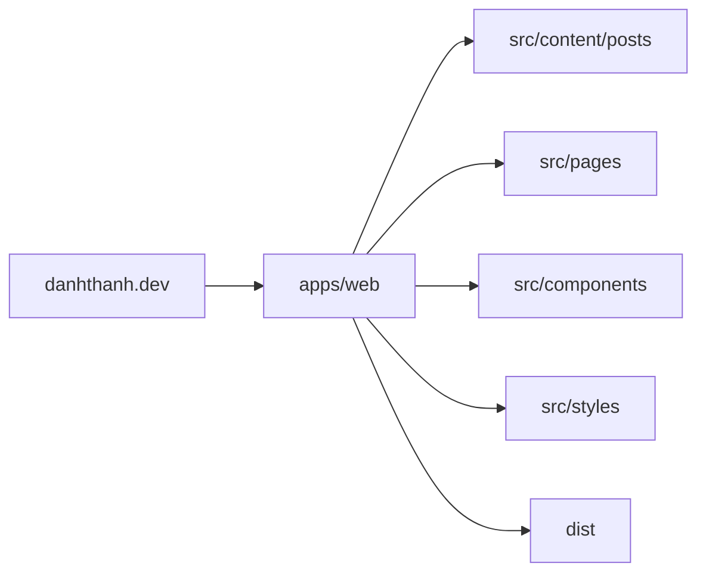
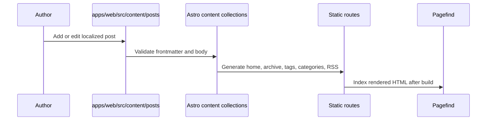
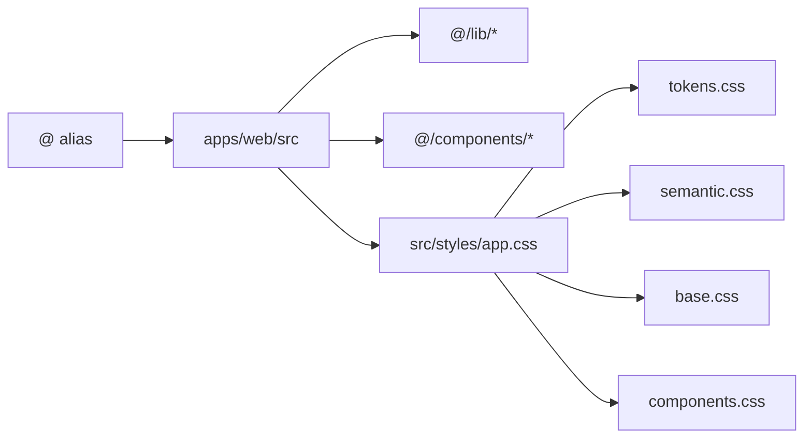

# Project Architecture

The repository is a single Astro 7 static site. The former StudioCMS/libSQL backend was removed; all public content is file-based and compiled during the web build.

## Workspace map

```mermaid
graph LR
  ROOT["danhthanh.dev"] --> WEB["apps/web"]
  WEB --> CONTENT["src/content/posts"]
  WEB --> PAGES["src/pages"]
  WEB --> COMPONENTS["src/components"]
  WEB --> STYLES["src/styles"]
  WEB --> DIST["dist"]
```

## Content flow

```mermaid
sequenceDiagram
  participant Author
  participant Markdown as apps/web/src/content/posts
  participant Collections as Astro content collections
  participant Pages as Static routes
  participant Search as Pagefind

  Author->>Markdown: Add or edit localized post
  Markdown->>Collections: Validate frontmatter and body
  Collections->>Pages: Generate home, archive, tags, categories, RSS
  Pages->>Search: Index rendered HTML after build
```

## Import and styling patterns

```mermaid
graph LR
  ALIAS["@ alias"] --> SRC["apps/web/src"]
  SRC --> LIB["@/lib/*"]
  SRC --> COMPONENTS["@/components/*"]
  SRC --> STYLES["src/styles/app.css"]
  STYLES --> TOKENS["tokens.css"]
  STYLES --> SEMANTIC["semantic.css"]
  STYLES --> BASE["base.css"]
  STYLES --> COMPONENT_CSS["components.css"]
```

## Deployment

`pnpm build` emits `apps/web/dist`. Deploy that directory to a static host or CDN. `SITE_URL` controls canonical URLs and generated metadata.
