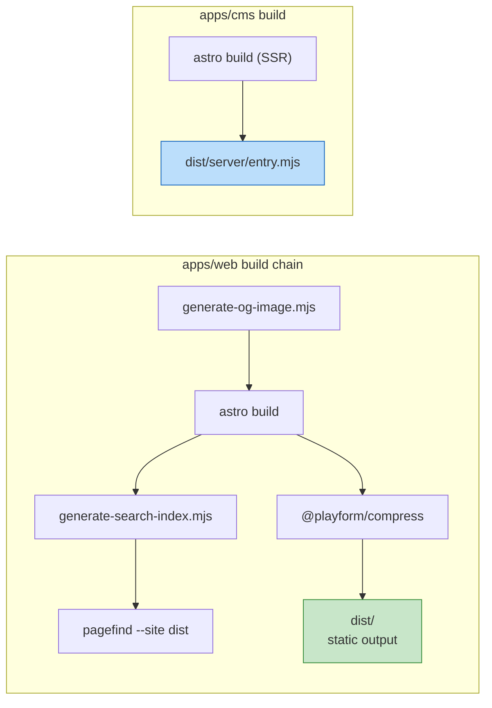
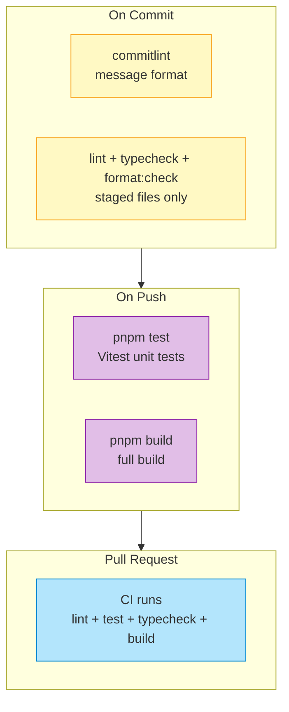
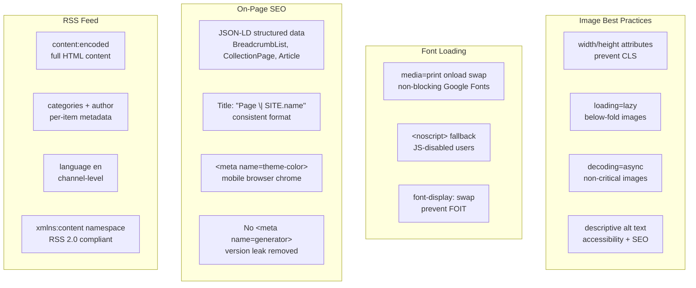

# Architecture Overview

This document describes the technical architecture of the danhthanh.dev monorepo. The repository contains two deployable Astro apps: a static public web app and a separate StudioCMS Node SSR app.

## System Architecture

```mermaid
graph TB
    Browser["Browser"]

    subgraph Web["Static Hosting (CDN)"]
        WEB_APP["apps/web<br/>Astro static site"]
        WEB_INDEX["Pagefind<br/>search index"]
    end

    subgraph CMS["Node.js Server"]
        CMS_APP["apps/cms<br/>StudioCMS SSR"]
    end

    subgraph Data["Persistence"]
        DB["libSQL / Turso<br/>CMS data + auth"]
    end

    Browser -->|&#34;GET /...&#34;| WEB_APP
    Browser -->|&#34;/studiocms/*&#34;| CMS_APP
    CMS_APP --> DB
    WEB_APP --- WEB_INDEX

    style WEB_APP fill:#a5d6a7,stroke:#2e7d32
    style CMS_APP fill:#90caf9,stroke:#1565c0
    style DB fill:#ffcc80,stroke:#ef6c00
    style WEB_INDEX fill:#c8e6c9,stroke:#388e3c
```



| Route              | App     | Purpose                            |
| ------------------ | ------- | ---------------------------------- |
| `/`                | web     | Homepage                           |
| `/blog`            | web     | Blog listing                       |
| `/blog/:slug`      | web     | Individual post                    |
| `/categories/:cat` | web     | Posts by category                  |
| `/tags/:tag`       | web     | Posts by tag                       |
| `/search`          | web     | Client-side search (Pagefind)      |
| `/rss.xml`         | web     | RSS feed                           |
| `/studiocms`       | cms     | StudioCMS dashboard (auth gated)   |
| `/studiocms_api`   | cms     | StudioCMS REST API                 |
| `/studiocms-blog`  | cms     | StudioCMS blog plugin routes       |

## Workspace Responsibilities

| Workspace  | Purpose                                                 | Build Output                     | Runtime        |
| ---------- | ------------------------------------------------------- | -------------------------------- | -------------- |
| `apps/web` | Public portfolio/blog, content collections, RSS, search | `apps/web/dist`                  | Static hosting |
| `apps/cms` | StudioCMS dashboard, auth, CMS APIs, CMS-managed routes | `apps/cms/dist/server/entry.mjs` | Node.js SSR    |

The workspaces are coordinated by `pnpm-workspace.yaml` and `turbo.json`. Root scripts delegate to filtered workspace tasks so local commands and CI can run from the repository root.

## Web App

`apps/web` is the public static site.

- **Framework**: Astro 5 static output.
- **Content source**: `apps/web/src/content/posts/**/*.{md,mdx}` through Astro content collections.
- **Blog routes**: Custom routes under `apps/web/src/pages/blog`.
- **Route helpers**: `apps/web/src/lib/routes.ts` encodes dynamic path segments consistently.
- **Visibility rules**: `apps/web/src/lib/post-visibility.ts` keeps draft and `noindex` posts out of public listings by default.
- **RSS**: Generated at `/rss.xml` using the same route helpers as the page routes.
- **Build optimization**: `@playform/compress` with lightningcss (CSS), terser (JS), svgo multipass (SVG), and html-minifier-terser (HTML) runs as the last Astro integration to minify static output.

## CMS App

`apps/cms` is the StudioCMS admin and API app.

- **Framework**: Astro 5 with `@astrojs/node` standalone output.
- **CMS**: StudioCMS 0.4 with database-backed content management.
- **Routes**: Dashboard at `/studiocms`, APIs under `/studiocms_api`, plugin content under `/studiocms-blog`.
- **Database**: libSQL, using local `file:./libsql.db` or remote Turso.
- **Authentication**: GitHub and Google OAuth configured against the CMS origin.

StudioCMS routes are intentionally separate from the custom public `/blog` routes so the static web app owns the main blog experience.

## Search System

- **Pagefind**: Build-time static search index generated from `apps/web/dist`.
- **Fuse.js**: Client-side fuzzy search refinement for loaded search data.
- **Search code**: `apps/web/src/lib/search.ts`, with Astro wrappers kept small.

The web build generates Open Graph assets, builds Astro output, generates search HTML, and then runs Pagefind against the static output.

```text
generate-og-image.mjs → astro build → generate-search-index.mjs → pagefind --site dist
```

## UI Layer

- **Styling**: Tailwind CSS 4 through `apps/web/src/styles/app.css`.
- **Token modules**: `tokens.css`, `semantic.css`, `base.css`, and `components.css`.
- **UI components**: Astro components plus selected React/shadcn components under `apps/web/src/components`.
- **Design tokens**: CSS custom properties mapped into Tailwind utilities with `@theme inline`.

### Web App Source Layout

```mermaid
graph TB
    subgraph Pages["src/pages/"]
        HOME["index.astro"]
        BLOG["blog/index.astro"]
        POST["blog/[...slug].astro"]
        SEARCH["search.astro"]
        RSS["rss.xml.js"]
    end

    subgraph Lib["src/lib/"]
        ROUTES["routes.ts<br/>URL helpers"]
        FILTER["filter.ts<br/>post filtering"]
        SEARCHLIB["search.ts<br/>Fuse.js client"]
        VISIBILITY["post-visibility.ts<br/>draft/noindex"]
    end

    subgraph Components["src/components/"]
        BLOGPOST["BlogPost.astro"]
        CARDS["Card components"]
        LAYOUTS["Layout components"]
        UI["shadcn/ui (React)"]
    end

    subgraph Content["src/content/"]
        POSTS["posts/**/*.&#123;md,mdx&#125;"]
    end

    subgraph Styles["src/styles/"]
        APP_CSS["app.css"]
        TOKENS["tokens.css"]
    end

    Pages --> Lib
    Pages --> Components
    Components --> Styles
    Content --> Pages

    style Pages fill:#e3f2fd,stroke:#1565c0
    style Lib fill:#fff3e0,stroke:#ef6c00
    style Components fill:#e8f5e9,stroke:#2e7d32
    style Content fill:#fce4ec,stroke:#c62828
    style Styles fill:#f3e5f5,stroke:#7b1fa2
```



## Configuration Files

| File                            | Purpose                                |
| ------------------------------- | -------------------------------------- |
| `pnpm-workspace.yaml`           | Workspace package boundaries           |
| `turbo.json`                    | Turborepo task graph                   |
| `apps/web/astro.config.mjs`     | Public web Astro config                |
| `apps/cms/astro.config.mjs`     | CMS Astro SSR config                   |
| `apps/cms/studiocms.config.mjs` | StudioCMS plugins and database dialect |
| `eslint.config.js`              | Root ESLint flat config                |
| `playwright.config.ts`          | E2E test config                        |
| `lefthook.yml`                  | Git hooks configuration                |
| `commitlint.config.js`          | Conventional commit rules              |

## Build Pipeline

Root `pnpm build` runs the Turborepo build graph for both deployable apps.



1. `apps/web`: OG image generation → Astro static build → search HTML → Pagefind indexing → asset compression.
2. `apps/cms`: Astro SSR build producing `dist/server/entry.mjs`.
3. Deployment publishes `apps/web/dist` to static hosting and runs `node apps/cms/dist/server/entry.mjs` for CMS.

### Content Creation To Publication Flow

```mermaid
sequenceDiagram
    participant CMS as CMS Dashboard<br/>(studiocms)
    participant DB as libSQL Database
    participant Content as src/content/posts
    participant Astro as Astro Build
    participant Compress as @playform/compress
    participant Pagefind as Pagefind Index
    participant CDN as Static Hosting
    participant User as Site Visitor

    CMS->>DB: Write/update post
    CMS->>Content: MD/MDX file generated
    activate Content
    Content->>Astro: Build: validate frontmatter + render
    deactivate Content
    Astro->>Compress: Minify HTML/CSS/JS/SVG
    deactivate Astro
    Compress->>Pagefind: Index static output
    Pagefind->>CDN: Deploy dist/
    User->>CDN: Visit site
    User->>Pagefind: Search
```

### Quality Gates



Quality is enforced at three stages:
- **Commit**: Conventional commit messages validated by commitlint. Staged files checked by lefthook (lint, typecheck, format).
- **Push**: Full vitest suite + production build must pass.
- **CI**: GitHub Actions repeats the full check pipeline on PRs.

See [Testing And Quality](#testing-and-quality) for details on the underlying tools.

## Testing And Quality

- **Unit tests**: Vitest tests in `apps/web/src/**/*.test.ts`.
- **E2E tests**: Playwright tests in `e2e/` against the web app.
- **Linting**: ESLint flat config with TypeScript, Astro, and Prettier integration.
- **Formatting**: Prettier with Astro and Tailwind plugins.
- **Hooks**: Lefthook runs commit message checks, pre-commit checks, and pre-push tests/build.

## SEO & Performance



| Area | Convention | File |
|------|-----------|------|
| Images | Every `` must have `width`/`height`; use `loading="lazy"` + `decoding="async"` for non-hero images | `CoverImage.astro`, `BlogCard.astro`, `search.ts` |
| Fonts | Google Fonts loaded with `media="print" onload="this.media='all'"` + `<noscript>` fallback | `BaseLayout.astro` |
| Titles | `${title} \| ${SITE.name}` on every page | All page components |
| JSON-LD | `BreadcrumbList` on blog index; `CollectionPage` on category/tag; `Article` on posts | Blog/tag/category pages |
| RSS | Full `content:encoded` with image + excerpt; per-item `categories`/`author`; channel `<language>` | `rss.xml.ts` |
| Meta | No `<meta name="generator">`; `theme-color` set for dark (#0a0a0a) and light (#ffffff) | `BaseLayout.astro` |

See [SEO & Performance Checklist](./seo-performance.md) for the full audit and maintenance guide.

## Related Topics

- [Environment Variables Reference](./environment-variables.md)
- [Development Workflow](../guides/development-workflow.md)
- [Deployment Guide](../guides/deployment.md)
- [SEO & Performance Checklist](./seo-performance.md)
