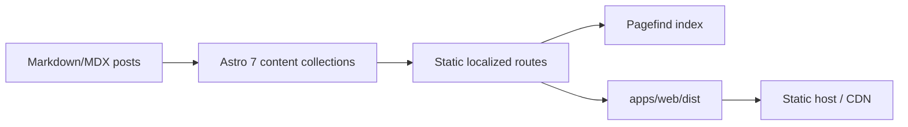

# Architecture Reference

This repository contains one deployable app: a static Astro 7 site in `apps/web`.

## Runtime shape

```mermaid
graph LR
  CONTENT["Markdown/MDX posts"] --> ASTRO["Astro 7 content collections"]
  ASTRO --> ROUTES["Static localized routes"]
  ROUTES --> SEARCH["Pagefind index"]
  ROUTES --> DIST["apps/web/dist"]
  DIST --> CDN["Static host / CDN"]
```

## Route ownership

| Route               | Owner                                         | Output                      |
| ------------------- | --------------------------------------------- | --------------------------- |
| `/:lang/`           | `apps/web/src/pages/[lang]/index.astro`       | Static HTML                 |
| `/:lang/blog`       | `apps/web/src/pages/[lang]/blog/index.astro`  | Static HTML + client filter |
| `/:lang/blog/:slug` | `apps/web/src/pages/[lang]/blog/[slug].astro` | Static HTML                 |
| `/:lang/about`      | `apps/web/src/pages/[lang]/about.astro`       | Static HTML                 |
| `/rss.xml`          | `apps/web/src/pages/rss.xml.ts`               | XML                         |

## Content flow

1. Authors add localized Markdown/MDX files under `apps/web/src/content/posts/{vi,en}`.
2. `src/content.config.ts` validates frontmatter and exposes the `posts` collection.
3. Static routes query the collection at build time.
4. `pagefind --site dist` creates the search index after Astro renders the site.

## Styling

`src/styles/app.css` is the only CSS entrypoint. It imports Tailwind CSS v4, shadcn-compatible semantic tokens, base rules, and component utilities. `@` resolves to `apps/web/src`.

## Build and deploy

`pnpm build` runs the OG image generator, agent index generator, Astro static build, and Pagefind. Deploy `apps/web/dist` to a static host. `SITE_URL` is used for canonical links, RSS, sitemap, and social metadata.
