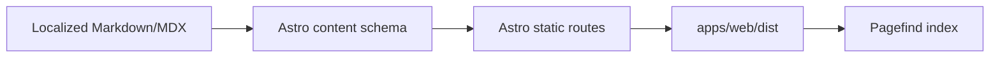

# Static Page Generation Flow

This project uses Astro 7 static output. Public content is authored as Markdown/MDX in `apps/web/src/content/posts` and never requires a runtime CMS or database.

## Build sequence

1. `generate-og-image.mjs` creates the shared social image.
2. `generate-agent-skills-index.mjs` writes the public skills index.
3. `astro build` validates content and renders all localized pages, tags, categories, RSS, sitemap, and API metadata.
4. `pagefind --site dist` indexes pages marked with `data-pagefind-body`.

## Source of truth

- `apps/web/src/content.config.ts` — frontmatter schema.
- `apps/web/src/lib/content-queries.ts` — file-based collection query helpers.
- `apps/web/src/pages/[lang]` — localized public routes.
- `apps/web/src/lib/post-visibility.ts` — publication filtering.

## Deployment

Deploy `apps/web/dist` to a static host. Set `SITE_URL` during the build so canonical URLs and generated feeds use the production domain.
